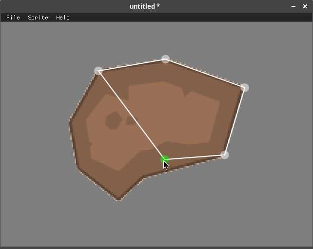

# cute-shaper

[](LICENSE)
[](https://github.com/bullno1/cute-shaper/actions/workflows/build.yml)

Collision shape editor, powered by [Cute Framework](https://randygaul.github.io/cute_framework/).



# Building
## Windows

Run msvc.bat to generate a solution and then build with MSVC.

## Linux

```
./boostrap
./build
```

The files should be in `bin/RelWithDebInfo`.

## Web

```
./boostrap
./build-web
```

The files should be in `bin/RelWithDebInfo`.

The web version can also be found at:

* https://bullno1.itch.io/cute-shaper
* https://bullno1.com/cute-shaper
